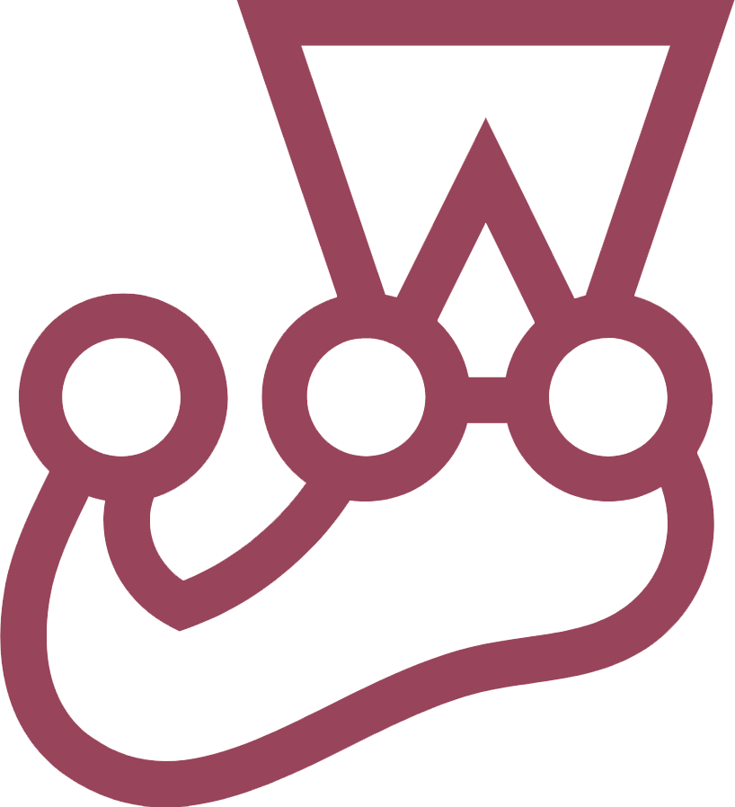

# Technical Proficiencies 💡
## Languages ✍️
### Programming 👩‍💻

### Others 📝

## Frameworks & Tools 🛠
### Frameworks 🧰

### Testing ✅

### Others 🌈

# Miscellaneous 🤹‍♀️
- Header is from [Lennart Butz](https://twitter.com/lennsan_)